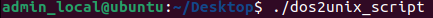

# DOS2UNIX File Manipulator Script

## Introduction
Hello, 

This script selects a file and then takes a DOS/Windows command as the first parameter and performs the equivalent UNIX command.

For example, in Windows command line when you want to move a file, you would execute `move C:\Users\username\Desktop\"cool movies.txt" C:\Users\username\Documents` to move the *cool movies.txt* file from the Desktop to the Documents folder. 
In UNIX systems, you would execute the `mv /home/user/Documents/file1.txt /home/user/Desktop` to move the *file1.txt* file from the documents folder to the desktop. 
This script performs these type of functions for your files and outputs the UNIX command used so you can learn as you go. 

This script is great for people who are familiar with Windows systems and are interested in learning how to navigate the command line, and manipulate files in UNIX systems. 

## Menu Screenshots
The following are screenshots of the menu:
- Executing the Script

- Main Menu

- Available Options

## Demo
The following demonstrates a file being renamed with this script:
- File Selection

- Option Selection

- Execution and End Result

## Improvements
Here are some improvements that can be made in the future: 
- An addition of an open function for pdf files or pictures
- A printing function that prints files using this script 
- A Zip function to compress folders or files
- A function to create a file
- Functions to change permissions for a particular file
